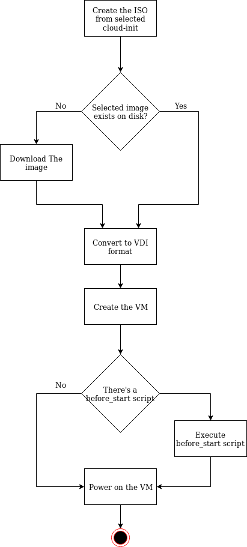

# How to Create a Virtual Machine

```bash
nuvm vm create -o Linux_64 -i centos-7 -H system-test -p 2222 -d 15 -c 5 -m 2048 -C common
```

## What are all these parameters

It's very simple to create a vm, you just need to decide some configurations, and you do that, using the follow parameters.

Nuvm Option | Name | Description | Required
------------ | ------------- | ------------ | -------------
-o | OS Type | The os type used by the virtualbox. | :squirrel:
-i | Image | The image that you'll use to create a vm. | :squirrel:
-d | Disk size | The VM disk size, the default depends on image size, like Debian-9 has 2Gb.| 
-H | Hostname | The VM hostname, used by nuvm, virtualbox and os. | :squirrel:
-m | Memory | The amount of ram memory available to the vm, the default is 1024Mb. |
-c | CPU | The number of CPU's available to the vm, the default is 4 CPU's. | 
-p | SSH PORT FORWARD |  The port on host to bind the vm ssh, the default is 2222 | 
-C | Cloud Init | The cloud-init with all necessary configurations. | :squirrel:

## Get OS Types
```bash
nuvm list os
``` 

## Get Images
```bash
nuvm list images
```

## Get Cloud-Init's
```bash
nuvm list cloud-init
```

## Why I need a port forward?

By default the nuvm create vms with a nat interface, so to get access to a service on the vm you need the port forward.
It's already on project roadmap, add an option to add a bridge interface.

# VM Creation Workflow

